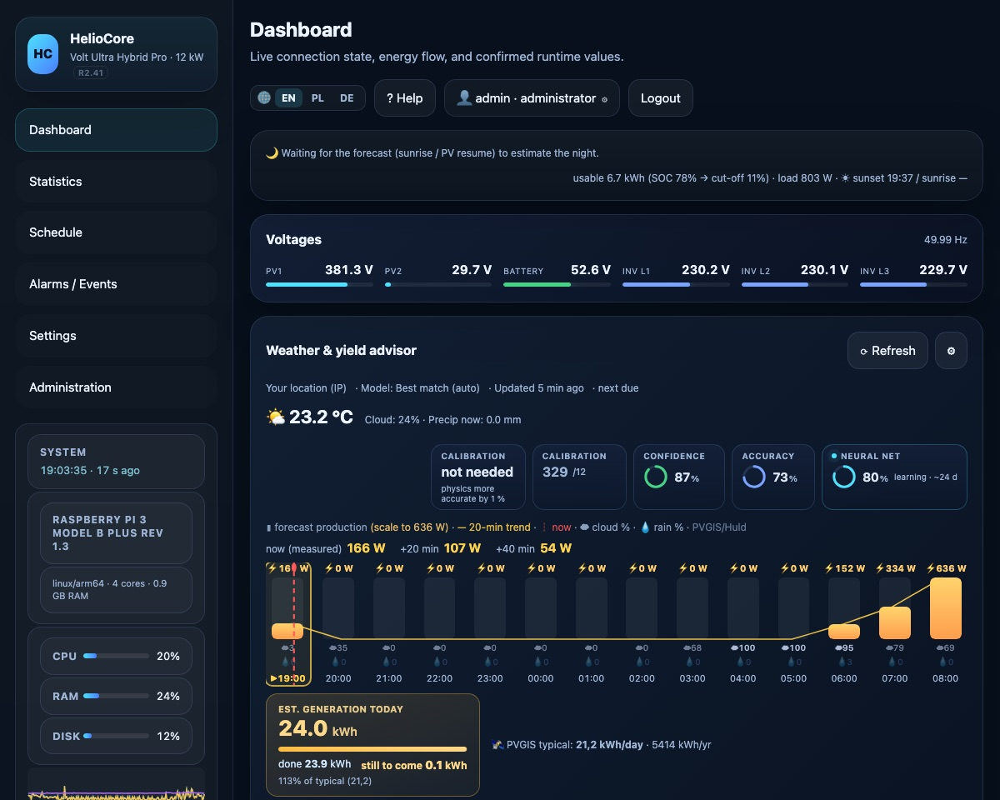

# HelioCore

**Solar monitoring and control that runs on your own hardware — no cloud.**

HelioCore reads your inverter over Modbus, forecasts the next hours of production and schedules your battery around your tariff. It runs on a Raspberry Pi or any computer on your network — one file to install, no Docker, no database to set up, no cloud account.

## Download

**➡ [Latest release](../../releases/latest)**

| System | File | Install |
|---|---|---|
| **Windows** (x86‑64) | `heliocore-setup-windows-amd64.exe` | Run the installer — it sets up the service and starts it. |
| **Raspberry Pi / Linux ARM64** | `heliocore-linux-arm64` | `chmod +x heliocore-linux-arm64 && sudo ./heliocore-linux-arm64 --install` |
| **Linux x86‑64** | `heliocore-linux-amd64` | `chmod +x heliocore-linux-amd64 && sudo ./heliocore-linux-amd64 --install` |

One file — nothing else needed. The UI, the HTTP server and the database are **built into the binary**. The software keeps itself updated afterwards.

Full installation guide, in **English, Polski and Deutsch**: **[heliocore.pl/install](https://heliocore.pl/#instalacja)**

## Install in 4 steps

1. Download the file for your system and run the install (table above).
2. Open the panel in a browser (`https://your-host:8443`) and create the administrator account.
3. Point it at the serial port or the inverter address — the panel shows what it found.
4. Register at **[heliocore.pl](https://heliocore.pl)** and enter the pairing code we send you by e‑mail. Done.

## Licence and price

The software is **free until 2 April 2027** — no fees, no card, no time limit on running it. Anyone who supports the project during this period receives a **perpetual licence**.

## What it does

- Live view (panel, battery and house power, refreshed every 2 s)
- Production forecast that learns your roof (separately for each panel orientation)
- Battery schedule from forecast and tariff — every change confirmed by reading the value back from the inverter
- Return on investment computed from your own measurements, at your own prices
- Statistics: day, week, season, year — all stored locally
- Backups, users with roles, diagnostics, CSV/API export

Works **off‑grid** too — it knows that a zero grid‑meter reading means "nothing to measure", not 100 %.

## Security and verification

Every release is **signed** (`MANIFEST` + `MANIFEST.sig`, release key `f106‑38e3‑dbb9‑557b`) and ships a full component list (`SBOM.json`). The Windows installer additionally verifies the payload signature before installing. Where you download from does not decide trust — the signature does.

## Platforms and inverters

Supported: Raspberry Pi (ARM64), Linux x86‑64, Windows x86‑64. One inverter model is hardware‑confirmed; the other profiles passed simulator testing (open phase).

---

**Website:** [heliocore.pl](https://heliocore.pl) · **Issues:** [Issues](../../issues) · The application UI is available in Polski, English and Deutsch.
